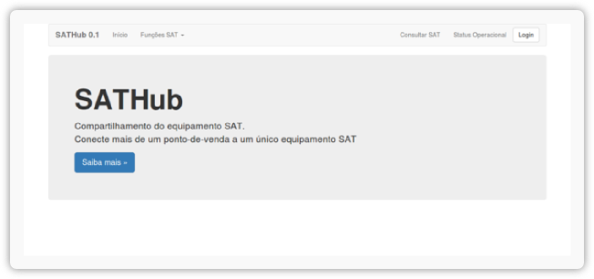
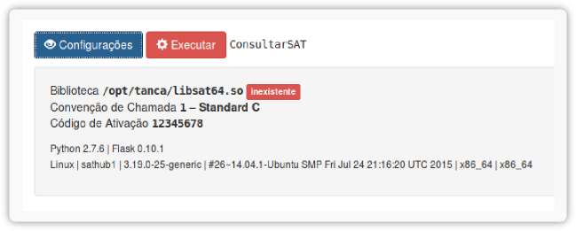

Instalação em Produção
======================

Em um ambiente de produção, onde 2 ou mais pontos-de-venda compartilham pelo
menos um equipamento SAT, a instalação requer um servidor HTTP mais robusto do
que o servidor de testes que acompanha o Flask. A maneira mais simples de
prover o compartilhamento do equipamento SAT parte de um PC comum que irá atuar
como um host Ubuntu Linux 14.04 server e um equipamento SAT conectado à ele.

.. note::

    Você deverá instalar as bibliotecas para Linux fornecidas pelo fabricante
    do seu equipamento SAT. Normalmente este processo significa apenas copiar
    os arquivos e dependências em um local específico, onde a aplicação SATHub
    terá permissão de leitura.

    Neste exemplo, consideramos que a biblioteca e suas dependências estão
    disponíveis em ``/opt/tanca/``, e que o host tem uma arquitetura de 64 bit,
    embora isso não tenha qualquer relevância prática.

O artigo de referência para este tópico é o excelente *Kickstarting Flask*
disponível no `Blog Real Python`_.

Recomendamos que você faça um teste antes em uma máquina `VirtualBox`_,
instalando uma imagem ISO do Ubuntu Linux 14.04 server, configurando a placa de
rede da máquina virtual para o modo *Bridge*. Durante a instalação do sistema,
defina o nome da máquina virtual como ``sathub1`` e o usuário como ``sathub``.
Quando a instalação terminar, a máquina virtual será reiniciada. Faça o login
e verifique o endereço IP que foi atribuído para a interface ``eth0``, com o
comando ``ifconfig`` (por exemplo ``10.0.0.107``).

Os comandos a seguir deverão ser digitados no terminal da máquina virtual:

.. sourcecode:: shell

    $ sudo apt-get install -y python-dev python-pip nginx gunicorn git supervisor
    $ sudo mkdir /home/www && cd /home/www
    $ sudo git clone https://github.com/base4sistemas/sathub.git
    $ cd sathub

Agora que o projeto SATHub já está instalado, é preciso configurá-lo, indicando
o caminho completo para a biblioteca SAT e, principalmente, o usuário e a senha
para acesso às funções SAT através do frontend web. Você não vai querer que
qualquer pessoa com acesso ao servidor SATHub seja capaz de trocar o código de
ativação do equipamento, ou bloqueá-lo, por exemplo.

.. sourcecode:: shell

    $ sudo vim conf.json

.. sourcecode:: json

    {
        "debug": false,
        "caminho_dll": "/opt/tanca/libsat64.so",
        "convencao_chamada": 1,
        "codigo_ativacao": "12345678",
        "usuario": "sathub",
        "senha": "sathub"
    }

Note que a convenção de chamada ``1`` significa **Standard C**. Use ``2`` se a
convenção de chamada for **Windows "stdcall"**. Em produção ``debug`` deverá
ser sempre ``false``.

Agora é preciso instalar as dependências do SATHub:

.. sourcecode:: shell

    $ sudo pip install -r requirements.txt

Para configuração do Nginx (servidor HTTP), iremos iniciá-lo e depois remover
suas configurações padrão, para substituirmos pela nossa configuração:

.. sourcecode:: shell

    $ sudo /etc/init.d/nginx start
    $ sudo rm /etc/nginx/sites-enabled/default
    $ sudo touch /etc/nginx/sites-available/sathub
    $ sudo ln -s /etc/nginx/sites-available/sathub /etc/nginx/sites-enabled/sathub
    $ sudo vim /etc/nginx/sites-enabled/sathub

As configurações do Nginx para o SATHub são:

.. sourcecode:: nginx

    server {
        location / {
            proxy_pass http://localhost:8000;
            proxy_set_header Host $host;
            proxy_set_header X-Real-IP $remote_addr;
        }
        location /static {
            alias  /home/www/sathub/sathub/static/;
        }
    }

Renicie o servidor Nginx e inicie servidor de aplicações gunicorn:

.. sourcecode:: shell

    $ sudo /etc/init.d/nginx restart
    $ cd /home/www/sathub
    $ sudo gunicorn sathub:app -b localhost:8000

Abra um navegador na máquina hospedeira e acesse o IP da máquina virtual. Você
deverá ver a página inicial do SATHub.

Faça login na página com o nome de usuário e senha que você configurou, acesse
a opção *Consultar SAT*, e clique no botão Configurações, para que você possa
conferir o status das configurações do SATHub, como na imagem abaixo:

Agora, para garantir que o servidor de aplicações seja iniciado quando a máquina
reiniciar, vamos instalar o controlador de processos `Supervisor`_. Se o
servidor de aplicações ainda estiver executando, interrompa-o (se o comando
``gunicorn`` prendeu o seu terminal, termine ele com ``Ctrl-C``):

.. sourcecode:: shell

    $ sudo pkill gunicorn

Vamos configurar o controlador de processos para iniciar a aplicação SATHub:

.. sourcecode:: shell

    $ sudo vim /etc/supervidor/conf.d/sathub.conf

Digite o seguinte:

.. sourcecode:: text

    [program:sathub]
    command = gunicorn sathub:app -b localhost:8000
    directory = /home/www/sathub
    user = root

E então reinicie e atualize o controlador de processos:

.. sourcecode:: python

    $ sudo supervisorctl reread
    $ sudo supervisorctl update
    $ sudo supervisorctl start sathub

Este é o procedimento mais simples para colocar o projeto SATHub em operação,
garantindo o compartilhamento do equipamento SAT para mais de um ponto-de-venda.

Se você tiver algum problema ao seguir estas instruções, a web está repleta de
recursos sobre o *stack* de software citados neste guia. De qualquer maneira
temos um canal via `Gitter Chat`_ onde você pode procurar por ajuda.

.. include:: referencias.rst
